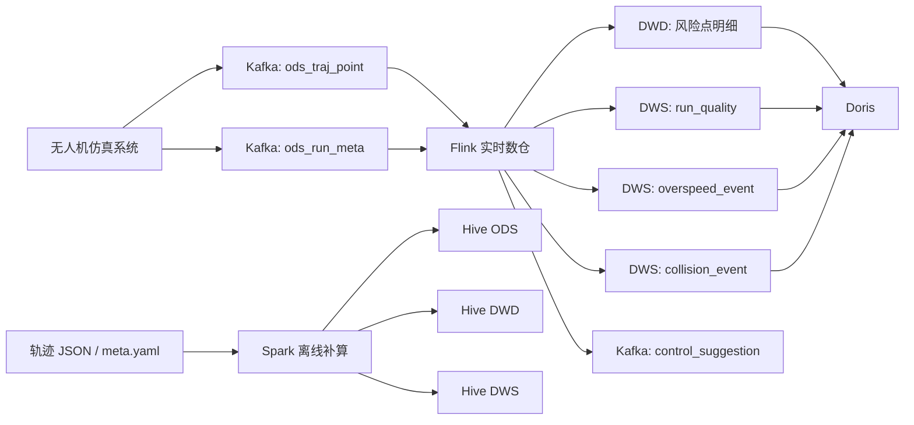

# UAV Real-Time Data Warehouse

> 一个面向**集群无人机仿真轨迹分析**的实时/离线一体化数仓项目。项目以 40ms/帧轨迹点流为输入，围绕**超速识别、碰撞检测、运行质量评估、控制建议输出**构建了完整的数据链路，适合作为数据开发 / 实时数仓 / Flink + Spark + Kafka + Hive + Doris 项目展示。

---

## 1. 项目简介

传统“数仓项目”往往偏业务报表，而这个项目更强调**实时检测能力 + 数据建模能力 + 工程落地能力**。

本项目的数据来源是无人机集群仿真系统：
- 轨迹点流按 **40ms 一帧**产生；
- 每次仿真任务对应一套独立参数配置（速度阈值、加速度阈值、最小安全距离等）；
- 需要在实时链路中完成异常识别与事件聚合，同时在离线侧保留可补算、可追溯、可复现的数据资产。

项目最终形成了两条协同链路：
- **实时链路（Flink）**：面向实时预警与实时指标；
- **离线链路（Spark + Hive）**：面向明细沉淀、补算、校验、复盘与实验对比。

---

## 2. 项目目标

本项目聚焦以下几类核心问题：

1. **同一套仿真运行参数如何动态作用到实时计算？**  
   通过 `run_meta` 控制流 + Flink `Broadcast State`，将每次 run 的阈值动态广播到点流计算链路。

2. **高频轨迹点如何建模成可分析的数据资产？**  
   将原始点流抽象为 ODS；在 DWD 计算速度、加速度、位移差分、风险标记；在 DWS 聚合出 run 级质量指标与事件段。

3. **如何兼顾实时告警与离线补算？**  
   实时侧聚焦 DWS 与轻量排障明细，离线侧承接完整 ODS / DWD / DWS 产物，避免实时库承载过多冷明细。

4. **如何让项目更接近真实数据开发场景？**  
   项目引入 Kafka、Flink 状态、Watermark、Doris、Hive、Spark 等组件，覆盖采集、处理、明细建模、汇总聚合、结果落库、补算回放等完整流程。

---

## 3. 总体架构



### 设计思路

- **Kafka** 作为实时采集入口，承接轨迹点与 run 元数据；
- **Flink** 负责实时数仓主链路：动态阈值广播、点级差分、异常识别、事件段聚合、质量汇总；
- **Doris** 承接实时结果查询，面向看板、排障和实验对比；
- **Spark + Hive** 承接离线补算与历史沉淀，保证链路可复算、可追溯、可对账；
- **控制建议 topic** 预留“数据驱动控制闭环”能力，为仿真系统回灌控制信号提供接口。

---

## 4. 数据分层设计

### ODS（原始接入层）

#### 1）`ods_run_meta`
存储每次仿真的运行元信息：
- `run_id`
- `scenario_id`
- `strategy_id`
- `strategy_version`
- `param_json`
- `param_set_id`
- `seed`
- `start_ms / end_ms / status / drone_count / duration_ms`

作用：
- 记录一次 run 的完整实验上下文；
- 支持参数追溯、实验复现、策略对比；
- 为实时/离线 DWD 计算提供阈值来源。

#### 2）`ods_traj_point`
存储高频轨迹点：
- `run_id`
- `drone_id`
- `seq`
- `t_ms`
- `x / y / z`
- 可选速度/加速度字段
- `point_key`

作用：
- 作为最原始的轨迹事实层；
- 支持后续差分、异常识别、事件段构建；
- 支持离线回放与补算。

---

### DWD（明细事实层）

核心表：
- **实时侧轻量表**：`dwd_risk_point_recent`
- **离线侧明细表**：`dwd_traj_point_detail_di`

主要衍生字段：
- `dt_ms`
- `dx / dy / dz`
- `dist`
- `speed`
- `acc`
- `is_time_back`
- `is_teleport`
- `is_overspeed`
- `is_overacc`
- `is_stuck`

这一层的核心价值是把“原始点”转成“可解释、可统计、可聚合”的业务明细。

---

### DWS（主题汇总层）

#### 1）`dws_run_quality`
按 run 汇总运行质量：
- 超速次数 `overspeed_cnt`
- 超加速度次数 `overacc_cnt`
- 瞬移次数 `teleport_cnt`
- 无人机数量 `drone_cnt`
- TopN 风险无人机 `top_drones_json`
- 打分权重 `score_weights_json`

#### 2）`dws_overspeed_event`
将连续超速点合并为超速事件段：
- `event_id`
- `start_seq / end_seq`
- `start_t_ms / end_t_ms`
- `duration_ms`
- `points_cnt`
- `max_speed / avg_speed`
- 起止坐标

#### 3）`dws_collision_event`
将逐帧碰撞命中聚合为碰撞事件段：
- `drone_a / drone_b`
- `start_t_ms / end_t_ms`
- `duration_ms`
- `frames_cnt`
- `min_dist / avg_dist`
- 起止位置

---

## 5. 实时链路核心实现

### 5.1 双 Topic 输入：轨迹点流 + 元数据流

实时 Producer 发送两个 Kafka Topic：
- `ods_run_meta`：每个 run 开始时发送一条元信息，结束时补发 end 状态；
- `ods_traj_point`：按 40ms 连续发送轨迹点，并在结束时发送 `run_end_marker`。  

这样做的好处：
- 轨迹点流保持高频轻量；
- 元数据流保持低频稳定；
- run 级参数与点级事实解耦，便于建模与扩展。

### 5.2 Broadcast State 动态阈值下发

Flink 主链路中，`run_meta` 不直接参与大表 Join，而是以 `BroadcastStream` 的方式广播到每个并行实例。轨迹点流按 `run_id + drone_id` 分组后，读取广播态中的阈值进行差分计算。

这解决了两个典型问题：
- 不同 run 对应不同阈值配置；
- 同一实时作业可以同时处理多次 run，而不需要硬编码阈值。

### 5.3 DWD 差分计算

在 `DwdDiffWithMetaFn` 中，基于 `ValueState` 保存上一轨迹点，计算：
- 时间差 `dt_ms`
- 三维位移 `dx / dy / dz`
- 欧氏距离 `dist`
- 速度 `speed`
- 加速度 `acc`

并进一步识别：
- 时间回退 `is_time_back`
- 瞬移 `is_teleport`
- 超速 `is_overspeed`
- 超加速度 `is_overacc`

### 5.4 Overspeed Segment：连续超速段聚合

超速不是简单统计点数，而是把**连续超速点**合并为事件段。当前实现包含以下工程语义：
- 小于最小点数的段视为噪声；
- 允许短暂的非超速点夹在段内；
- 对乱序、重复点、seq gap 做保护；
- 长时间空闲时触发 idle flush，避免段丢失。

### 5.5 Collision Detection：空间网格 + 窗口检测

碰撞检测采用：
- 按 `run_id` 分组；
- 基于事件时间窗口做逐帧快照；
- 使用三维网格划分（Spatial Grid）减少 pairwise 全量比较；
- 输出逐帧 `CollisionHit`；
- 再聚合为 `CollisionEvent` 段。

这一部分体现了项目的算法工程化能力：不是只会做 SQL 聚合，而是把空间邻域检索与流式事件聚合结合起来。

### 5.6 run_end_marker + Event Time 定稿

Producer 在 run 结束时，会向 `ods_traj_point` 发送一条 `run_end_marker`，用于推动 Watermark，并触发实时 DWS 定稿。

这样可以解决一个很典型的实时问题：
- run 结束后，如何让窗口/状态知道“可以输出最终结果并清理状态”。

对应地：
- `RunQualityAggFn` 使用 event-time timer 进行最终输出；
- `CollisionSegmentAggFn` 依赖 end marker flush 段状态；
- 实时作业结束语义更完整，不会只得到“中间快照”。

### 5.7 控制建议输出：预留闭环能力

碰撞命中结果还会进一步生成 `control_suggestion` 消息，并通过 cooldown 逻辑进行节流，避免连续帧刷爆下游 Topic。

这部分虽然是轻量实现，但意义很大：
- 让项目从“只做分析”延伸到“分析驱动控制”；
- 为后续接入仿真器反馈控制、策略联动留出了接口。

---

## 6. 离线链路核心实现

离线链路不是实时链路的简单复制，而是承担三个职责：

1. **历史沉淀**：将轨迹 JSON 与 `meta.yaml` 规范化导入 Hive；
2. **离线补算**：当实时链路逻辑调整、需要重算历史 run 时，可以批量回放；
3. **结果复盘**：支持按 run 维度分析策略效果、异常分布与事件段表现。

### 6.1 ODS 构建

`OdsBuildJob` 完成：
- `meta.yaml -> ods_run_meta_di`
- `trajectories_takeoff.json -> ods_traj_point_di`

处理细节包括：
- 统一 `run_id / scenario_id / strategy_id` 规范；
- 将整份 YAML 规范化为 `param_json`；
- 生成 `param_set_id` 便于实验比对；
- 自动补齐 `start_ms / end_ms / duration_ms / drone_count`。

### 6.2 DWD 构建

`DwdBuildJob` 基于 Spark SQL + 窗口函数完成差分：
- `lag` 取上一点；
- 计算 `dt_ms / dist / speed / acc`；
- 衍生 `is_time_back / is_teleport / is_overspeed / is_overacc`。

这让离线 DWD 与实时 DWD 在业务语义上保持一致，便于对账与复盘。

### 6.3 DWS 构建

目前离线侧覆盖：
- `dws_run_quality_di`
- `dws_overspeed_event_di`
- `dws_collision_event_di`（批入口已集成）

其中：
- `DwsRunQualityBuildJob` 负责 run 级质量汇总与 TopN 风险无人机统计；
- `DwsOverspeedEventBuildJob` 负责连续超速段识别；
- 批入口 `OfflineBatchMain` 串联 ODS → DWD → DWS 全流程，便于一次性补算。

---

## 7. 为什么实时侧只保留轻量 DWD，而不是全量明细都落实时库？

这是本项目一个很重要的设计取舍：

### 保留轻量 DWD 的原因
- 实时排障需要能快速看到异常点，而不是只看聚合结果；
- 风险点明细数量远小于全量点，适合放在 Doris 中做即席查询；
- 对面试官来说，这能体现你理解“明细保留”和“存储成本”的平衡。

### 不保留全量实时 DWD 的原因
- 轨迹点是高频数据，长期保留全量明细会增加实时存储压力；
- 大部分分析诉求最终落在 DWS 结果或离线复盘，不需要所有明细都留在实时分析库；
- 完整 ODS / DWD / DWS 可由离线链路承接，更符合冷热分层思路。

所以当前方案是：
- **实时侧**：DWS + 轻量风险点明细；
- **离线侧**：完整 ODS / DWD / DWS。

---

## 8. 技术栈

- **采集 / 消息队列**：Kafka
- **实时计算**：Flink
- **实时分析存储**：Doris
- **离线计算**：Spark SQL
- **离线数仓**：Hive
- **数据格式**：JSON / Parquet / YAML
- **开发语言**：Java / Python

---

## 9. 项目亮点

### 亮点 1：动态阈值广播，而不是写死规则
不是把速度阈值、碰撞距离写死在代码里，而是通过 run 级 `param_json` 动态下发，支持不同实验参数并行运行。

### 亮点 2：同时覆盖“点级明细”和“事件级事实”
很多项目只做到明细异常打标，这个项目进一步把连续异常点聚合成事件段，更接近真实业务分析口径。

### 亮点 3：事件时间语义完整
通过 `run_end_marker + watermark + event-time timer` 完成 DWS 定稿，避免只得到中间态结果。

### 亮点 4：实时与离线口径对齐
离线侧不是另外一套逻辑，而是尽量复刻实时规则，体现了数仓项目中非常关键的“统一口径”意识。

### 亮点 5：具备闭环扩展空间
控制建议 Topic 让项目不只停留在“看结果”，而是具备“结果驱动控制”的演进潜力。

---

## 10. 适合面试重点展开的话题

如果你是面试官，我建议重点追问这些点：

1. **为什么需要 `run_meta` 和 `traj_point` 拆成两个 Topic？**
2. **Broadcast State 解决了什么问题？有没有状态膨胀风险？**
3. **为什么 DWD 要做差分，而不是直接在 DWS 聚合？**
4. **为什么实时侧保留轻量 DWD，而不是只保留 DWS？**
5. **为什么 run 结束时要发 `run_end_marker`？**
6. **碰撞检测为什么不直接全量两两比较？**
7. **离线补算如何保证和实时口径一致？**
8. **Doris 和 Hive 在这个项目里分别承担什么角色？**

---

## 11. 项目目录建议

```text
.
├── realtime/
│   ├── src/main/java/com/rtw/
│   │   ├── Main.java
│   │   ├── pipelines/PipelineDwd.java
│   │   ├── ops/
│   │   ├── functions/
│   │   └── serde/
│   └── ...
├── offline-batch/
│   ├── src/main/java/com/rtw/
│   │   ├── OfflineBatchMain.java
│   │   ├── job/
│   │   ├── util/
│   │   └── config/
│   └── data/
├── producer/
│   └── producer.py
├── viewer/
├── output/
└── README.md
```

> 你可以根据实际仓库结构微调这一节，但建议保留“realtime / offline / producer / data”这类分层目录，便于招聘方快速建立认知。

---

## 12. 快速开始

### 12.1 实时链路

1. 启动 Kafka / Doris / Flink 环境；
2. 运行实时主程序；
3. 使用 Producer 发送 `run_meta` 与 `traj_point`；
4. 在 Doris 中查看实时结果表。

核心入口：
- 实时主程序：`Main.java`
- 实时主链路：`PipelineDwd.java`
- 数据发送端：`producer.py`

### 12.2 离线链路

1. 准备 `meta.yaml` 与 `trajectories_takeoff.json`；
2. 配置 `OfflineJobConfig` 中的输入目录与 warehouse 路径；
3. 运行 `OfflineBatchMain`；
4. 在 Hive 中查看 ODS / DWD / DWS 结果表。

核心入口：
- 批处理主程序：`OfflineBatchMain.java`
- ODS 构建：`OdsBuildJob.java`
- DWD 构建：`DwdBuildJob.java`
- DWS 构建：`DwsRunQualityBuildJob.java` / `DwsOverspeedEventBuildJob.java`

---

## 13. 当前项目定位

这个项目不是纯粹的算法项目，也不是只会建几张表的“样板数仓项目”，而是一个：

- 有明确业务对象（集群无人机仿真）的项目；
- 有清晰实时诉求（超速、碰撞、质量评估、控制建议）的项目；
- 有完整数仓分层（ODS / DWD / DWS）的项目；
- 有实时与离线协同能力（Flink + Spark/Hive）的项目；
- 能支撑面试中深入展开状态、窗口、Watermark、建模、补算、对账、冷热分层等话题的项目。

---

## 14. 后续可扩展方向

- 增加 **DIM 维表 / 策略维度 / 场景维度**，完善星型模型表达；
- 增加 **离线与实时自动对账**，形成数据质量闭环；
- 引入 **更细粒度控制建议策略**，从“预警”走向“控制”；
- 引入 **实验看板**，支持不同 `strategy_id / param_set_id` 对比分析；
- 将项目从本地单机场景扩展到更标准的分布式部署方式。

---

## 15. 致谢

本项目重点不在“堆砌技术名词”，而在于把**业务语义、实时处理、数仓建模、工程实现**串成一个完整闭环。

如果你正在找数据开发 / 实时数仓 / 大数据开发方向的实习或校招岗位，这类项目比单纯写几个 SQL 更能体现你的思考深度。
